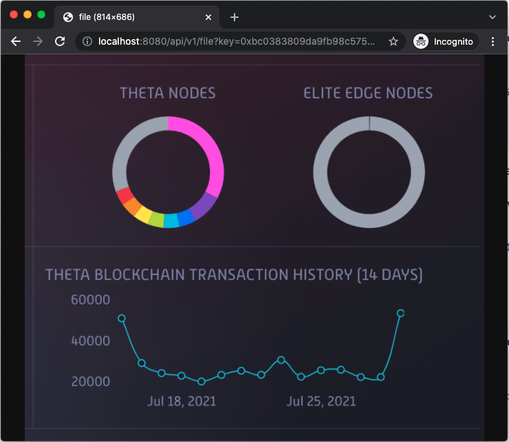

# Image File Storage and Serving

This simple example demonstrates how to upload/retrieve image files to/from a local single-node EdgeStore Network. Although here we only shows how to interact with a single node network, you can also deploy and interact with a multi-node network over the Internet (reference [here](../website/README.md#demo-for-local-multiple-node-network) and [here](../website/README.md#multi-node-network-over-the-internet)). One can extend this demo to implement interesting applications such as acting as a permanet storage network for the image assets for NFTs.

## Upload and Retrieve Image Files

#### Launch a single-node EdgeStore private network

If you haven't done so, please follow [this guide](../../docs/SETUP.md#edgestore-setup) to setup the EdgeStore environment, and launch a [single node network]((../../docs/SETUP.md#launch-a-single-node-edgestore-private-network)).

#### Upload/Download an image file

Use the following commands to upload the `smiley_explorer.png` file:

```shell
cd ~/edge-store-playground
./bin/edgestore file put --path="theta-edge-store-demos/demos/image/data/smiley_explorer.png"

# the command should return the following
# {
#     "key": "0xbc0383809da9fb98c5755e3fa4f19f4ebc7e34308ab321246e4bb54e548fad04",
#     "relpath": "smiley_explorer.png",
#     "success": true
# }
```

The EdgeNode provides a [REST API](../../docs/API.md#rest-apis) for the users to download the image files uploaded to the network with the keys and relative path of the image files. By default, the REST server runs at port 8080 (can be changed to other ports through `rest.port` in the `config.yaml` file under the config folder). Simply open a browser window and go to the following URL:

http://localhost:8080/api/v1/file?key=0xbc0383809da9fb98c5755e3fa4f19f4ebc7e34308ab321246e4bb54e548fad04&relpath=smiley_explorer.png

#### Upload/Download a directory containing multiple images

We can also upload and retrieve a folder with multiple images:

```shell
./bin/edgestore file put --path="theta-edge-store-demos/demos/image/data"

# the command should return the following
# {
#     "key": "0xdacc9a23035a458f21aa0cb51189d715cb5c43d7ff4c0227cca5c25eeef3d5b4",
#     "relpath": "data",
#     "success": true
# }
```

Now, we can retrieve the two images under the `data` folder thorugh the following URL. Note that we need to pass in the `relpath`, i.e. the relative path of each image file as a query parameter.

- smiley_explorer.png: http://localhost:8080/api/v1/file?key=0xdacc9a23035a458f21aa0cb51189d715cb5c43d7ff4c0227cca5c25eeef3d5b4&relpath=data/smiley_explorer.png

- theta_network.jpg: http://localhost:8080/api/v1/file?key=0xdacc9a23035a458f21aa0cb51189d715cb5c43d7ff4c0227cca5c25eeef3d5b4&relpath=data/theta_network.jpg

You should see something like this in your browser :)

