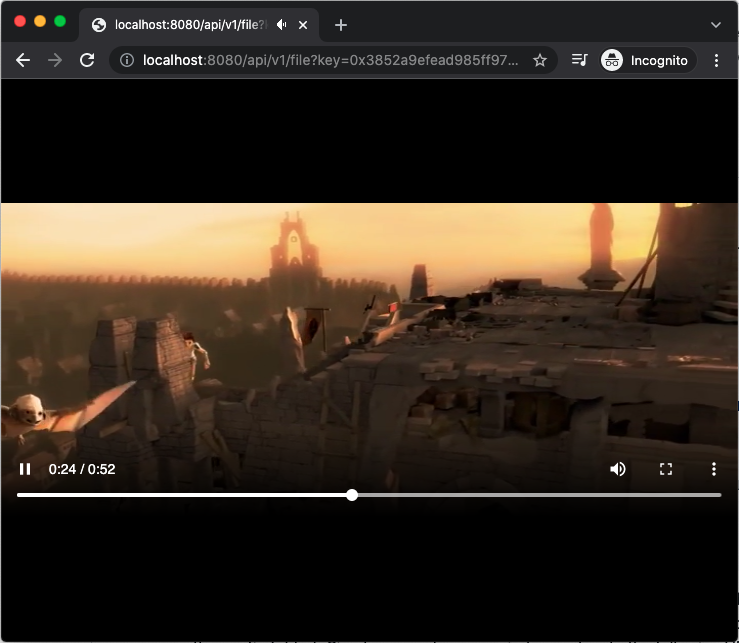

# MP4 Video File Storage and Serving

This simple example demonstrates how to upload/retrieve an MP4 video file to/from a local single-node EdgeStore Network. Although here we only shows how to interact with a single node network, you can also deploy and interact with a multi-node network over the Internet (reference [here](../website/README.md#demo-for-local-multiple-node-network) and [here](../website/README.md#multi-node-network-over-the-internet)). One can extend this demo to implement interesting applications such as acting as a permanet storage network for the video assets for NFTs.

## Upload and Retrieve Video Files

#### Launch a single-node EdgeStore private network

If you haven't done so, please follow [this guide](../../docs/SETUP.md#edgestore-setup) to setup the EdgeStore environment, and launch a [single node network]((../../docs/SETUP.md#launch-a-single-node-edgestore-private-network)).

#### Upload/Download an MP4 video file

Use the following commands to upload the `720.mp4` file:

```shell
cd ~/edge-store-playground
./bin/edgestore file put --path="theta-edge-store-demos/demos/mp4/data/720.mp4"

# the command should return the following
# {
#     "key": "0x3852a9efead985ff970b2f289ef070b0eafbe5371b7433611fe1c6c2c4d009cd",
#     "relpath": "720.mp4",
#     "success": true
# }
```

The EdgeNode provides a [REST API](../../docs/API.md#rest-apis) for the users to playback videos uploaded to the network with the keys and the relative path of the video file. By default, the REST server runs at port 8080 (can be changed to other ports through `rest.port` in the `config.yaml` file under the config folder). Simply open a browser window and go to the following URL:

http://localhost:8080/api/v1/file?key=0x3852a9efead985ff970b2f289ef070b0eafbe5371b7433611fe1c6c2c4d009cd&relpath=720.mp4

You should see the mp4 video playback in your browser similar to the following:

