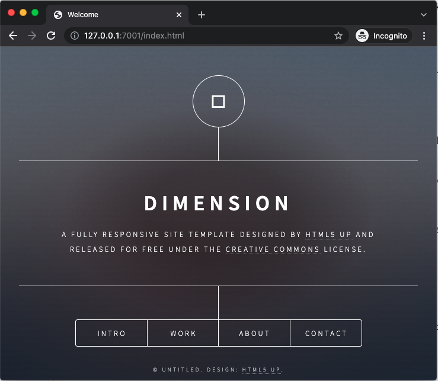

# Serving Web Apps

This example demonstrates how to upload a Web App to the Theta EdgeStore Network, and serve the site with Node.js. In this example, the EdgeStore network serves as a permanent storage network for the Web App. Moreoever, each EdgeStore node also caches the popular contents locally. Therefore, the network also acts as a decentralized content delivery network (dCDN) for the Web App.

### Table of Contents
1. [Demo for Local Multiple Node Network](#demo-for-local-multiple-node-network)
2. [Multi-Node Network over the Internet](#multi-node-network-over-the-internet)

## Demo for Local Multiple Node Network

This sections shows you how to setup a local multi-node EdgeStore network, and then upload a HLS VoD stream to the network through the first node, and playback the stream from the third node.

### Launch a multi-node EdgeStore private network

If you haven't done so, please follow [this guide](../../docs/SETUP.md#edgestore-setup) to setup the EdgeStore environment, and launch a [multi-node network]((../../docs/SETUP.md#launch-a-multi-node-edgestore-private-network)) on your local computer.

### Upload the Web App

Next, in a new terminal, deploy the web app to the Theta EdgeStore Network through the first node.

```shell
cd ~/edge-store-playground
EDGESTORERPCENDPOINT=http://127.0.0.1:19888/rpc ./bin/edgestore file put --path="theta-edge-store-demos/demos/website/site"

# the command should return the following
# {
#     "key": "0x6f53fee958b163734dffe22270c14eb72348ce99475f197b2020c6738d4b98f1",
#     "relpath": "site",
#     "success": true
# }
```
### Start the server for the Web App

Finally, start the Node.js server to serve the web app. Note that we specify port 8082 since the third node EdgeStore instance runs its REST server at this port.

```shell
cd ~/edge-store-playground/theta-edge-store-demos/demos/website

# Start the server serving the website. Note that we specify port 8082 since the third node EdgeStore instance runs its REST server at this port.
node serv.js ../../../privatenet/multi-node/node3/storage/file_cache 0x6f53fee958b163734dffe22270c14eb72348ce99475f197b2020c6738d4b98f1 site 8082
```

To visit the site, open a browser and navigate to http://127.0.0.1:7001/index.html 

You should see Web App in your browser, similar to the following:



## Multi-Node Network over the Internet

To setup a multi-node network over the Internet, simply modify the `p2p.seeds` config in the `config.yaml` file for the nodes. For example, you can deploy three nodes on three different cloud instances. The nodes do not need to be on the same network. For example, you can run one node in GCP, another in AWS, and the third on your local computer. However, you would need to configure the firewall rules properly to allow inbound/outbound traffics on the `p2p.port`, so that the nodes can communicate with each other. Once the firewall rules are set up, you can run the EdgeStore nodes with commands similar to the above. They should be able to connect to each other and forms a unified permanent storage network. In our implementation, each EdgeStore node also caches the popular contents locally. Therefore, the network also acts as a decentralized content delivery network (dCDN) for any type of file.
